# Chamu ERD

Generated from the Laravel migrations in `database/migrations`. The checked-in `database/database.sqlite` currently contains only the base auth tables, so this diagram reflects the intended migration schema rather than the live SQLite file.

## Education And Admissions

```mermaid
erDiagram
    COUNTRIES ||--o{ PROVINCES : has
    PROVINCES ||--o{ CITIES : has
    CITIES ||--o{ SUBURBS : has

    COUNTRIES ||--o{ CURRICULUMS : supports
    CURRICULUMS ||--o{ GRADES : defines
    NQF_LEVELS ||--o{ GRADES : maps_to
    SUBJECT_CATEGORIES ||--o{ SUBJECTS : classifies
    CURRICULUMS ||--o{ SUBJECTS : offers
    GRADES ||--o{ SUBJECTS : includes
    CURRICULUMS ||--o{ TERMS : has
    GRADES ||--o{ TERMS : has
    PAPERS ||--o{ TOPICS : groups
    GRADES ||--o{ TOPICS : has
    TERMS ||--o{ TOPICS : schedules
    SUBJECTS ||--o{ TOPICS : has
    TOPICS ||--o{ TOPIC_SKILLS : breaks_into
    TOPICS ||--o{ TOPIC_CONTENTS : contains
    SUBJECTS ||--o{ TOPIC_CONTENTS : owns

    SUBJECTS ||--o{ PAST_PAPERS : has
    PAST_PAPERS ||--o{ PAST_PAPER_QUESTIONS : contains
    SUBJECTS ||--o{ PAST_PAPER_QUESTIONS : tags
    TOPICS ||--o{ PAST_PAPER_QUESTIONS : tags
    TOPIC_SKILLS ||--o{ PAST_PAPER_QUESTIONS : tags
    PAPERS ||--o{ PAST_PAPER_QUESTIONS : groups
    PROVINCES ||--o{ PAST_PAPER_QUESTIONS : contextualizes

    ANSWERS ||--o{ QUESTIONS : correct_answer
    SUBJECTS ||--o{ QUESTIONS : has
    TOPICS ||--o{ QUESTIONS : has
    TOPIC_SKILLS ||--o{ QUESTIONS : tags
    PAPERS ||--o{ QUESTIONS : groups
    PROVINCES ||--o{ QUESTIONS : contextualizes
    QUESTIONS ||--o{ SUB_QUESTIONS : has
    ANSWERS ||--o{ SUB_QUESTIONS : correct_answer

    CURRICULUMS ||--o{ SCHOOLS : follows
    PROVINCES ||--o{ SCHOOLS : located_in
    USER_TYPES ||--o{ USERS : classifies
    SCHOOLS ||--o{ USERS : enrolls
    USERS ||--o{ USERS : parent_of
    CURRICULUMS ||--o{ USERS : follows
    GRADES ||--o{ USERS : current_grade
    COUNTRIES ||--o{ USERS : lives_in
    PROVINCES ||--o{ USERS : lives_in

    USERS ||--o{ USER_SUBJECT_PREFERENCES : chooses
    CURRICULUMS ||--o{ USER_SUBJECT_PREFERENCES : scopes
    GRADES ||--o{ USER_SUBJECT_PREFERENCES : scopes
    SUBJECTS ||--o{ USER_SUBJECT_PREFERENCES : chosen
    USERS ||--o{ USER_SUBJECT_RESULTS : earns
    GRADES ||--o{ USER_SUBJECT_RESULTS : for_grade
    TERMS ||--o{ USER_SUBJECT_RESULTS : in_term
    SUBJECTS ||--o{ USER_SUBJECT_RESULTS : measured

    TOPICS ||--o{ NOTE_DECKS : has
    SUBJECTS ||--o{ NOTE_DECKS : has
    NOTE_DECKS ||--o{ NOTE_CARDS : contains
    USERS ||--o{ USER_NOTE_DECKS : owns
    SUBJECTS ||--o{ USER_NOTE_DECKS : scopes
    TOPICS ||--o{ USER_NOTE_DECKS : scopes
    USER_NOTE_DECKS ||--o{ USER_NOTE_CARDS : contains

    USERS ||--o{ EXAM_SESSIONS : starts
    SUBJECTS ||--o{ EXAM_SESSIONS : scopes
    CURRICULUMS ||--o{ EXAM_SESSIONS : scopes
    EXAM_SESSIONS ||--o{ EXAM_SESSION_QUESTIONS : includes
    QUESTIONS ||--o{ EXAM_SESSION_QUESTIONS : source
    PAST_PAPER_QUESTIONS ||--o{ EXAM_SESSION_QUESTIONS : source
    EXAM_SESSIONS ||--o{ EXAM_SESSION_ANSWERS : captures
    QUESTIONS ||--o{ EXAM_SESSION_ANSWERS : answered
    SUB_QUESTIONS ||--o{ EXAM_SESSION_ANSWERS : answered
    USERS ||--o{ QUESTION_ATTEMPTS : makes
    QUESTIONS ||--o{ QUESTION_ATTEMPTS : attempted
    SUB_QUESTIONS ||--o{ QUESTION_ATTEMPTS : attempted
    PAST_PAPER_QUESTIONS ||--o{ QUESTION_ATTEMPTS : attempted
    EXAM_SESSIONS ||--o{ QUESTION_ATTEMPTS : groups

    USERS ||--o{ LEADERBOARDS : scores
    SCHOOLS ||--o{ LEADERBOARDS : scopes
    SUBJECTS ||--o{ LEADERBOARDS : scopes
    TOPICS ||--o{ LEADERBOARDS : scopes
    QUESTIONS ||--o{ AI_EXPLANATIONS : explains
    PAST_PAPER_QUESTIONS ||--o{ AI_EXPLANATIONS : explains
    TOPICS ||--o{ AI_EXPLANATIONS : explains

    COUNTRIES ||--o{ UNIVERSITIES : hosts
    UNIVERSITIES ||--o{ FACULTIES : has
    UNIVERSITIES ||--o{ QUALIFICATIONS : offers
    FACULTIES ||--o{ QUALIFICATIONS : owns
    NQF_LEVELS ||--o{ QUALIFICATION_TYPES : maps_to
    QUALIFICATION_TYPES ||--o{ QUALIFICATIONS : types
    NQF_LEVELS ||--o{ QUALIFICATIONS : maps_to
    GRADES ||--o{ QUALIFICATIONS : required_grade
    QUALIFICATIONS ||--o{ QUALIFICATION_SUBJECT_REQUIREMENTS : requires
    SUBJECTS ||--o{ QUALIFICATION_SUBJECT_REQUIREMENTS : subject
    GRADES ||--o{ QUALIFICATION_SUBJECT_REQUIREMENTS : grade
    QUALIFICATIONS ||--o{ QUALIFICATION_ADMISSION_SCORE_VARIANTS : has
    SUBJECTS ||--o{ QUALIFICATION_ADMISSION_SCORE_VARIANTS : subject

    SUBJECTS ||--o{ ADMISSION_RULES : life_orientation
    ADMISSION_RULES ||--o{ UNIVERSITY_ADMISSION_RULES : applied_as
    UNIVERSITIES ||--o{ UNIVERSITY_ADMISSION_RULES : scopes
    FACULTIES ||--o{ UNIVERSITY_ADMISSION_RULES : scopes
    QUALIFICATIONS ||--o{ UNIVERSITY_ADMISSION_RULES : scopes
    GRADES ||--o{ UNIVERSITY_ADMISSION_RULES : scopes

    COMPANIES ||--o{ BURSARIES : funds
    BURSARIES ||--o{ BURSARY_SUBJECT_REQUIREMENTS : requires
    SUBJECTS ||--o{ BURSARY_SUBJECT_REQUIREMENTS : subject
    GRADES ||--o{ BURSARY_SUBJECT_REQUIREMENTS : grade

    CURRICULUMS ||--o{ CHARADE_CATEGORIES : groups
    SUBJECTS ||--o{ CHARADE_CATEGORIES : scopes
    TOPICS ||--o{ CHARADE_CATEGORIES : scopes
    CHARADE_CATEGORIES ||--o{ CHARADE_CARDS : contains
    SUBJECTS ||--o{ CHARADE_CARDS : scopes
    TOPICS ||--o{ CHARADE_CARDS : scopes
    TOPIC_SKILLS ||--o{ CHARADE_CARDS : scopes
    USERS ||--o{ CHARADE_SESSIONS : plays
    SUBJECTS ||--o{ CHARADE_SESSIONS : scopes
    TOPICS ||--o{ CHARADE_SESSIONS : scopes
    CHARADE_SESSIONS ||--o{ CHARADE_SESSION_CARDS : includes
    CHARADE_CARDS ||--o{ CHARADE_SESSION_CARDS : played

    USERS ||--o{ SITE_VISITS : visits
    USERS ||--o{ AUDIT_LOGS : creates
```

## Legacy Property And Leasing Migrations

These tables are present in the migration set but are separate from the current education/admissions model:

- Setup and geography: `property_types`, `unit_types`, `asset_informations`, `properties`, `units`
- Tenant profiles: `tenants`, `genders`, `marital_statuses`, `ethnicities`, `languages`
- Leasing operations: `lease_templates`, `leases`, `lease_versions`, `documents`, `invoices`, `deposits`, `communications`, `maintenance_types`, `maintenance_logs`, `check_in_outs`
- Marketplace/community: `listings`, `listing_pictures`, `applications`, `comments`, `reviews`, `flags`, `chats`, `reaction_types`, `reactions`
- Team joins: `teams`, `team_user`, `team_invitations`, `team_tenants`, `duplicate_tenants`, `note_tenants`

